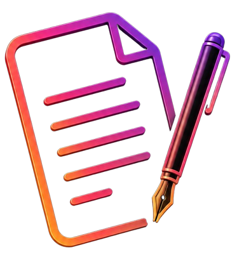
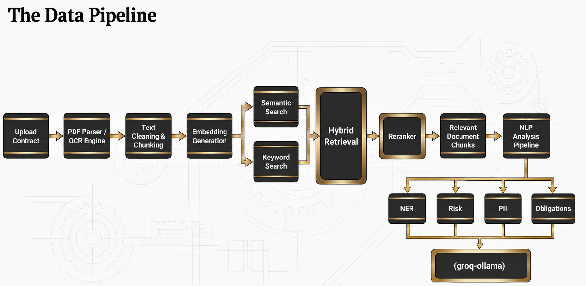
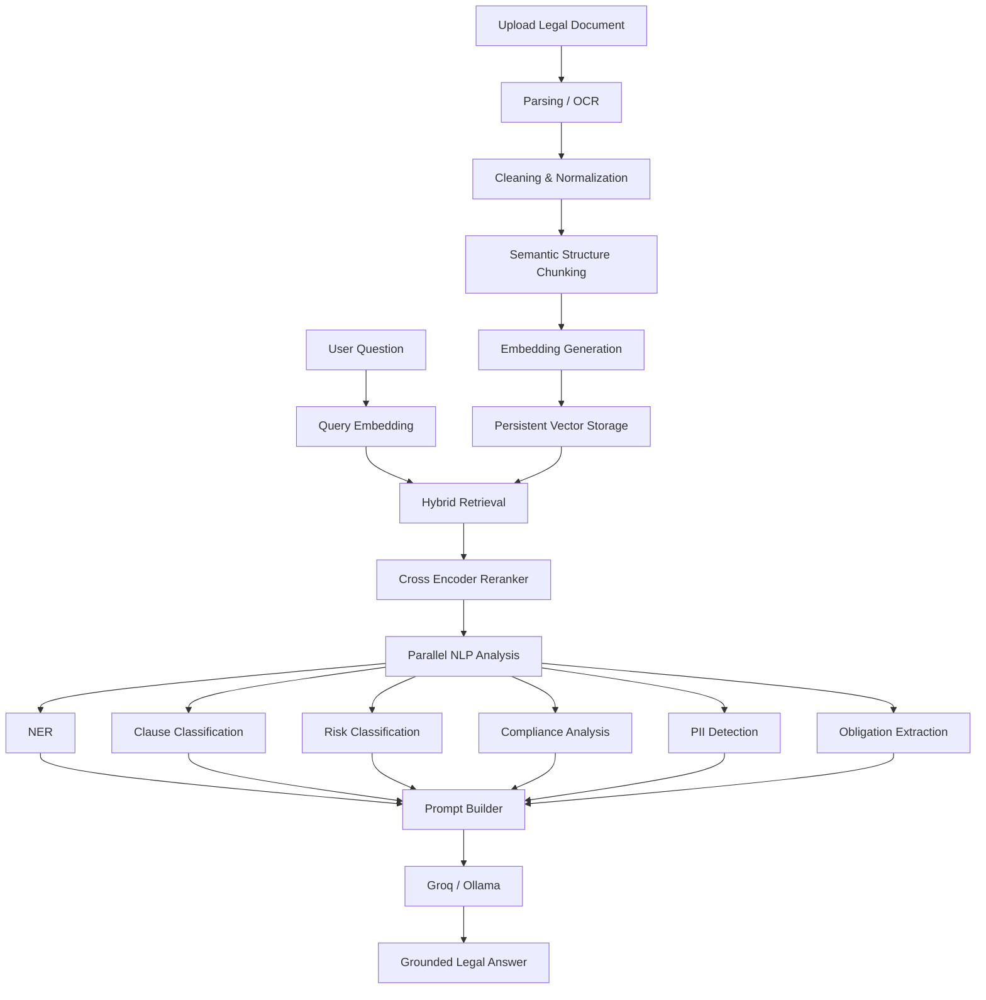

  

<h2 align="center">
⚖️ Terms is an AI-powered legal assistant that simplifies contract review and analysis
It combines NLP, Transformer models, and Retrieval-Augmented Generation to help you understand any legal document before you sign
</h2>

  
  

# 📌 Project Overview

Terms is an AI-powered legal document analysis platform that leverages **Natural Language Processing (NLP)**, **Transformer Models**, **Retrieval-Augmented Generation (RAG)**, and **Large Language Models (LLMs)** to help users understand complex legal documents quickly and accurately.

Instead of manually reading lengthy contracts or privacy policies, users simply upload a document and receive AI-powered insights including clause classification, risk assessment, compliance analysis, obligation extraction, named entities, and conversational question answering grounded in the uploaded document.

> **This system assists users in understanding legal documents and is not a replacement for professional legal advice.**

# 🧰 Tools & Technologies

# 🎯 Project Objectives

* Build an end-to-end platform that turns dense legal documents into clear, actionable insight.
* Support multiple input formats: PDF, DOCX, scanned images, audio, and raw text.
* Apply NLP-based clause classification and risk assessment to flag what matters.
* Detect named entities and personally identifiable information (PII) automatically.
* Extract obligations, deadlines, and compliance gaps without manual reading.
* Ground every AI answer in the uploaded document using Retrieval-Augmented Generation.
* Support both English and Arabic legal documents.

# ⚡ Challenges

* Handling multiple document formats (PDF, DOCX, scanned images, audio) reliably.
* Detecting natural legal boundaries (articles, clauses, sections) instead of naive fixed-size splitting.
* Balancing semantic and keyword retrieval so exact clause references are never missed.
* Reducing hallucination while keeping answers fluent and useful.
* Supporting Arabic and English legal terminology in the same pipeline.
* Keeping PII detection and compliance checks accurate across varied contract types.

---

# 🏗 System Architecture

## The Data Pipeline

---

# 🧠 AI / NLP Pipeline

---

# 🧩 Core Components

## 📑 Semantic Structure Chunking

Instead of splitting documents into fixed-size blocks, the system first detects natural legal boundaries such as:

* Articles
* Sections
* Headings
* Numbered Clauses
* Paragraphs

Each semantic unit is then packed into overlapping chunks to preserve context, improving retrieval and answer accuracy.

## 🔍 Hybrid Retrieval (Semantic + Keyword)

* **Semantic Search** — finds information based on meaning using vector embeddings, so "What happens if I resign?" correctly matches a "Termination of Employment" clause.
* **Keyword Search** — retrieves exact matches instantly, e.g. a direct reference like "Clause 7.2".
* Both are merged before reranking for higher recall and precision.

## 🎯 Cross-Encoder Reranker

The first retrieval stage may return 20–30 candidate chunks. The reranker evaluates these more accurately and keeps only the most relevant ones before they reach the LLM — improving grounding and reducing hallucination.

## 🧠 Parallel NLP Analysis

Multiple specialized models analyze the retrieved text simultaneously:

* Clause Classification (LegalBERT)
* Risk Classification (DeBERTa)
* Named Entity Recognition (GLiNER)
* Compliance Analysis (rule-based)
* PII Detection (Microsoft Presidio)
* Obligation Extraction

## 💬 Prompt Builder

Instead of sending only the user's question to the LLM, the Prompt Builder combines the retrieved chunks, the question, clause classifications, risk predictions, named entities, compliance results, obligations, and PII findings into a single structured context — producing grounded, explainable answers.

---

# 📡 API Overview

The backend exposes RESTful APIs built with **FastAPI**.

| Method | Endpoint    | Description                              |
| ------ | ----------- | ----------------------------------------- |
| POST   | `/upload`   | Upload legal documents                    |
| POST   | `/chat`     | Ask questions about uploaded documents    |
| POST   | `/analyze`  | Perform complete legal document analysis  |
| GET    | `/health`   | Health check endpoint                     |
| POST   | `/login`    | User authentication                       |
| POST   | `/register` | User registration                         |

---

# ✨ Key Features

### 📄 Multi-format Document Support
PDF · DOCX · Images (OCR) · Audio · Raw Text

### 🌍 Multilingual Support
English · Arabic

### 🤖 AI-Powered Legal Analysis
Legal Clause Classification · Risk Classification · Named Entity Recognition (NER) · PII Detection · Compliance Checking · Obligation Extraction · Deadline Extraction

### 🔐 Authentication
Email Authentication · Google Authentication · Guest Mode

### 📊 Reports
Risk Reports · Compliance Reports · Clause Analysis · Obligation Summaries · Source-Cited Answers

---

# 💡 Example Use Cases

* **📱 Terms & Conditions** — understand key obligations and hidden clauses before accepting online agreements.
* **🔒 Privacy Policies** — identify data collection, third-party sharing, user rights, and consent requirements.
* **💼 Employment Contracts** — analyze salary clauses, termination clauses, working hours, and employee obligations.
* **🏠 Rental Agreements** — review rent obligations, maintenance responsibilities, deposit conditions, and lease termination.
* **🤝 NDAs** — extract confidentiality obligations, restricted disclosures, duration, and penalties.
* **📑 Business Contracts** — analyze responsibilities, payment terms, legal risks, and missing clauses.

---

# 🚀 Design Decisions

**Why FastAPI?** High performance, async processing, automatic Swagger docs, and strong AI-library integration with Pydantic validation.

**Why Hybrid RAG?** Pure semantic search can miss exact legal references; pure keyword search can't understand meaning. Combining both significantly improves retrieval quality.

**Why Reranking?** Similarity search is fast but not always precise — the Cross-Encoder reranks candidates with a more powerful model before generation.

**Why LegalBERT?** Pretrained on legal corpora, it understands legal terminology, contract structure, and clause relationships better than general-purpose BERT.

**Why Retrieval-Augmented Generation?** Instead of relying only on the LLM's internal knowledge, the system retrieves evidence directly from the uploaded document — reducing hallucinations and grounding every answer.

**Why Multiple AI Models?** Each model specializes in one task (retrieval, classification, extraction, generation), making the platform modular, accurate, and easy to extend.

---

# 📈 Future Improvements

Multi-document analysis · Contract comparison · Legal Knowledge Graph · Fine-tuned Legal LLM · Better Arabic legal models · Citation verification · Agentic legal workflows · Browser extension · Mobile application · Cloud deployment · Enterprise document management

---

# 👨‍💻 Team Members

### Abdallah Mohamed Abdelzaher

### Farida Mohamed Abdelaziz

### Michael Medhat Yacoup

### Bouthina Mohamed Abdelwahab

### Abdelrahman Eslam Omar

---

# 🤝 Contributing

Contributions are welcome. To improve the project:

1. Fork the repository.
2. Create a feature branch.
3. Commit your changes.
4. Open a Pull Request.

---

# 📜 License

This project is released under the **MIT License**.

---

# 🙏 Acknowledgements

FastAPI · Hugging Face Transformers · Sentence Transformers · GLiNER · Microsoft Presidio · LangGraph · ONNX Runtime · Groq · Ollama

We thank the open-source community for making these tools available.

---

# ⭐ Project Summary

**Terms** is an AI-powered legal document analysis platform that combines modern NLP, Retrieval-Augmented Generation (RAG), transformer models, and Large Language Models to provide accurate, explainable, and grounded legal document understanding — reducing hallucinations and improving trust in every answer.
