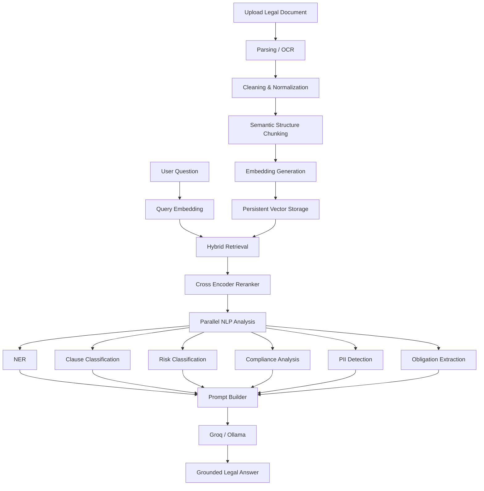

# ⚖️ Terms
## AI-Powered Legal Document & Terms Analyzer

> **Understand legal documents before you sign or click "Accept".**

Terms is an AI-powered legal document analysis platform that leverages **Natural Language Processing (NLP)**, **Transformer Models**, **Retrieval-Augmented Generation (RAG)**, and **Large Language Models (LLMs)** to help users understand complex legal documents quickly and accurately.

Instead of manually reading lengthy contracts or privacy policies, users simply upload a document and receive AI-powered insights including clause classification, risk assessment, compliance analysis, obligation extraction, named entities, and conversational question answering grounded in the uploaded document.

---

## 📌 Motivation

Legal documents are often lengthy, complex, and difficult for non-lawyers to understand.

Most users accept:

- Terms & Conditions
- Privacy Policies
- Employment Contracts
- Lease Agreements
- Service Agreements
- NDAs

without fully reading them.

This project aims to simplify legal document analysis by combining traditional NLP techniques with modern transformer models and Retrieval-Augmented Generation to provide accurate, explainable, and grounded responses.

> **This system assists users in understanding legal documents and is not a replacement for professional legal advice.**

---

# ✨ Key Features

### 📄 Multi-format Document Support

- PDF
- DOCX
- Images (OCR)
- Audio
- Raw Text

---

### 🌍 Multilingual Support

- English
- Arabic

---

### 🤖 AI-Powered Legal Analysis

- Legal Clause Classification
- Risk Classification
- Named Entity Recognition (NER)
- Personally Identifiable Information (PII) Detection
- Compliance Checking
- Obligation Extraction
- Deadline Extraction

---

### 🔍 Advanced Retrieval-Augmented Generation (RAG)

Unlike traditional RAG systems, this project implements a production-style retrieval pipeline:

- Semantic Structure Chunking
- Embedding Generation
- Persistent Embedding Storage
- Hybrid Retrieval
  - Semantic Search
  - Keyword Search
- Cross-Encoder Reranking
- Source-grounded Prompt Construction

---

### 💬 AI Legal Assistant

Users can ask natural language questions such as:

> "What happens if I terminate this contract early?"

or

> "What obligations does the tenant have?"

The answer is generated using retrieved evidence from the uploaded document instead of relying only on the LLM's internal knowledge.

---

### 🔐 Authentication

Supports:

- Email Authentication
- Google Authentication
- Guest Mode

---

### 📊 Reports

The platform automatically generates:

- Risk Reports
- Compliance Reports
- Clause Analysis
- Obligation Summaries
- Source-Cited Answers

---

# ⭐ Architecture Highlights

This project combines multiple AI techniques instead of relying on a single model.

Main architectural features include:

- Hybrid Retrieval (Semantic + Keyword Search)
- Cross-Encoder Reranking
- Semantic Structure-Based Chunking
- Retrieval-Augmented Generation (RAG)
- Parallel NLP Analysis
- Prompt Engineering
- Grounded LLM Responses
- Persistent Embedding Storage
- Modular AI Services
- FastAPI Backend
- LangGraph Workflow

---

# 🏗 System Architecture

```text
                     User Uploads Document
                              │
                ┌─────────────┴──────────────┐
                │                            │
          PDF / DOCX                  Image / Scan
                │                            │
          Text Extraction                  OCR
                │                            │
                └─────────────┬──────────────┘
                              │
                      Text Preprocessing
                              │
                 Semantic Structure Chunking
                              │
                  Embedding Generation (E5)
                              │
                Persistent Embedding Storage
                              │
                     Vector Database Index
                              │
────────────────── User Asks Question ──────────────────
                              │
                  Query Embedding Generation
                              │
                  Hybrid Retrieval Pipeline
                 ┌────────────┴─────────────┐
                 │                          │
          Semantic Search           Keyword Search
                 │                          │
                 └────────────┬─────────────┘
                              │
                   Cross-Encoder Reranker
                              │
                 Top Relevant Document Chunks
                              │
               Parallel NLP Processing Modules
      ┌──────────┬─────────┬─────────┬─────────┬─────────┐
      │          │         │         │         │
     NER     Clause    Risk      PII      Compliance
            Classifier Classifier Detection  Analysis
                              │
                    Obligation Extraction
                              │
                      Prompt Builder
                              │
                 Groq / Ollama Large Language Model
                              │
                 Grounded AI Response + Citations
```

---

# 🧠 AI / NLP Pipeline



---

# 🎯 Why This Architecture?

Rather than depending solely on a Large Language Model, the system combines specialized NLP components with Retrieval-Augmented Generation.

Each module performs a dedicated task:

- Retrieval finds the most relevant document sections.
- NER identifies important legal entities.
- LegalBERT classifies legal clauses.
- DeBERTa estimates legal risks.
- Presidio detects sensitive information.
- Rule-based compliance checks verify contract completeness.
- Obligation extraction identifies responsibilities.
- The LLM generates fluent, human-readable answers using all extracted information.

This hybrid architecture improves accuracy, reduces hallucinations, and produces responses grounded in the uploaded legal document.

---

# 📡 API Overview

The backend exposes RESTful APIs built with **FastAPI**.

## Main Endpoints

| Method | Endpoint | Description |
|---------|----------|-------------|
| POST | `/upload` | Upload legal documents |
| POST | `/chat` | Ask questions about uploaded documents |
| POST | `/analyze` | Perform complete legal document analysis |
| GET | `/health` | Health check endpoint |
| POST | `/login` | User authentication |
| POST | `/register` | User registration |

---

# 🔄 End-to-End Workflow

```text
                    User
                      │
         Upload Legal Document
                      │
              FastAPI Backend
                      │
          Parsing / OCR Engine
                      │
          Cleaning & Normalization
                      │
      Semantic Structure Chunking
                      │
          Embedding Generation
                      │
        Persistent Vector Storage
                      │
──────────────────────────────────────────────
              User asks Question
                      │
             Query Embedding
                      │
     Hybrid Retrieval Pipeline
                      │
    Semantic Search + Keyword Search
                      │
       Cross Encoder Reranking
                      │
      Top Relevant Document Chunks
                      │
        Parallel NLP Components
                      │
     Prompt Construction (Context)
                      │
            Groq / Ollama LLM
                      │
         Grounded Legal Response
```

---

# 🧩 NLP Components

## 📑 Semantic Structure Chunking

Instead of splitting documents into fixed-size blocks, the system first detects natural legal boundaries such as:

- Articles
- Sections
- Headings
- Numbered Clauses
- Paragraphs

Each semantic unit is then packed into chunks with overlap to preserve context.

Benefits:

- Better retrieval
- Better context preservation
- More accurate answers

---

## 🔍 Hybrid Retrieval

The retrieval layer combines two complementary search strategies.

### Semantic Search

Finds information based on meaning using vector embeddings.

Example

```
Question:
What happens if I resign?

Document:
Termination of Employment
```

Semantic search understands that both refer to similar concepts.

---

### Keyword Search

Finds exact matches.

Example

```
Clause 7.2
```

The exact clause can be retrieved immediately.

---

### Hybrid Search

The system merges both retrieval methods before reranking.

Advantages

- Higher recall
- Higher precision
- Better legal document retrieval

---

## 🎯 Cross-Encoder Reranker

The first retrieval stage may return 20–30 candidate chunks.

The reranker evaluates these candidates more accurately and selects only the most relevant ones before sending them to the LLM.

Benefits

- Better grounding
- Less hallucination
- More accurate responses

---

## 🧠 Parallel NLP Analysis

Multiple AI models analyze the retrieved text simultaneously.

The platform performs:

- Clause Classification
- Risk Classification
- Named Entity Recognition
- Compliance Analysis
- PII Detection
- Obligation Extraction

Each module contributes structured information to the final prompt.

---

## 💬 Prompt Builder

Instead of sending only the user question to the LLM, the Prompt Builder combines:

- Retrieved document chunks
- User question
- Clause classifications
- Risk predictions
- Named entities
- Compliance results
- Obligations
- PII findings

This structured context enables the LLM to generate grounded and explainable answers.

---

# 💡 Example Use Cases

### 📱 Terms & Conditions Analysis

Understand the key obligations and hidden clauses before accepting online agreements.

---

### 🔒 Privacy Policy Review

Identify:

- Data collection
- Third-party sharing
- User rights
- Consent requirements

---

### 💼 Employment Contracts

Automatically analyze:

- Salary clauses
- Termination clauses
- Working hours
- Employee obligations

---

### 🏠 Rental Agreements

Review:

- Rent obligations
- Maintenance responsibilities
- Deposit conditions
- Lease termination

---

### 🤝 Non-Disclosure Agreements (NDAs)

Extract:

- Confidentiality obligations
- Restricted disclosures
- Agreement duration
- Penalties

---

### 📑 Business Contracts

Analyze:

- Responsibilities
- Payment terms
- Legal risks
- Missing clauses
- Compliance issues

---

# 🚀 Design Decisions

## Why FastAPI?

- High performance
- Asynchronous processing
- Automatic Swagger documentation
- Excellent integration with AI libraries
- Built-in validation using Pydantic

---

## Why Hybrid RAG?

Pure semantic search may miss exact legal references.

Keyword search cannot understand semantic meaning.

Combining both retrieval methods significantly improves retrieval quality.

---

## Why Reranking?

Similarity search is fast but not always precise.

The Cross-Encoder reranks candidate chunks using a more powerful model, improving answer quality before generation.

---

## Why LegalBERT?

LegalBERT has been pretrained on legal corpora.

Compared to a general BERT model, it better understands:

- Legal terminology
- Contract structure
- Clause relationships
- Legal language

---

## Why Retrieval-Augmented Generation?

Instead of relying only on the LLM's internal knowledge, the system retrieves evidence directly from the uploaded document.

This:

- Reduces hallucinations
- Improves factual accuracy
- Grounds answers in the document
- Supports document-specific Q&A

---

## Why Multiple AI Models?

Each model specializes in one task.

Rather than forcing one model to perform every task, the system combines:

- Retrieval
- Classification
- Information Extraction
- Rule-based Analysis
- Natural Language Generation

This modular architecture improves accuracy and makes the platform easier to extend.

---

# 📈 Future Improvements

- Multi-document analysis
- Contract comparison
- Legal Knowledge Graph
- Fine-tuned Legal LLM
- Better Arabic legal models
- Multi-language legal support
- Citation verification
- Agentic legal workflows
- Browser extension
- Mobile application
- Cloud deployment
- Enterprise document management

---

# 👥 Contributors

This project was built by:

| Name | LinkedIn |
|------|----------|
| Abdallah Mohamed Abdelzaher | [linkedin.com/in/abdallahabdelzaher](https://www.linkedin.com/in/abdallahabdelzaher/) |
| Farida Mohamed Abdelaziz | [linkedin.com/in/farida-mohamed-5a68b4315](https://www.linkedin.com/in/farida-mohamed-5a68b4315) |
| Michael Medhat Yacoup | [linkedin.com/in/michael-medhat-74a243306](https://www.linkedin.com/in/michael-medhat-74a243306) |
| Bouthina Mohamed Abdelwahab | [linkedin.com/in/bouthina-mohamed-a75b0b323](https://www.linkedin.com/in/bouthina-mohamed-a75b0b323) |
| Abdelrahman Eslam Omar | — |

---

# 🤝 Contributing

Contributions are welcome.

If you would like to improve the project:

1. Fork the repository.
2. Create a feature branch.
3. Commit your changes.
4. Open a Pull Request.

---

# 📜 License

This project is released under the **MIT License**.

---

# 🙏 Acknowledgements

This project builds upon several outstanding open-source technologies:

- FastAPI
- Hugging Face Transformers
- Sentence Transformers
- GLiNER
- Microsoft Presidio
- LangGraph
- ONNX Runtime
- Groq
- Ollama

We thank the open-source community for making these tools available.

---

# ⭐ Project Summary

**Terms** is an AI-powered legal document analysis platform that combines modern NLP, Retrieval-Augmented Generation (RAG), transformer models, and Large Language Models to provide accurate, explainable, and grounded legal document understanding.

Unlike traditional chatbots, the platform employs a **hybrid AI architecture** featuring semantic structure chunking, hybrid retrieval, cross-encoder reranking, LegalBERT classification, GLiNER entity recognition, Microsoft Presidio for PII detection, compliance analysis, and grounded LLM responses.

This modular architecture enables scalable, accurate, and production-ready legal document analysis while significantly reducing hallucinations and improving explainability.
